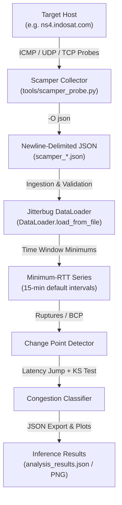

# Scamper Data Collection & Jitterbug Congestion Inference Guide

This guide details how to collect Round-Trip Time (RTT) measurements using **[scamper](https://www.caida.org/catalog/software/scamper/)** (by CAIDA), save the results in newline-delimited JSON format, and analyze the data using **Jitterbug** to detect and quantify network congestion events.

---

## 1. Architecture & Data Flow



---

## 2. Probing Only: Collect RTT Data to JSON

Use [**`tools/scamper_probe.py`**](file:///Users/dikshie/VIRTUAL/jitterbug/tools/scamper_probe.py) or [**`tools/probe_target.sh`**](file:///Users/dikshie/VIRTUAL/jitterbug/tools/probe_target.sh) when collecting RTT time series for later analysis.

### Quick Example: Probe `ns4.indosat.com`

```bash
# Probe ns4.indosat.com for 120 probes (1 probe per second) and save to JSON
uv run python tools/scamper_probe.py \
  --target ns4.indosat.com \
  --count 120 \
  --output scamper_ns4_indosat.json \
  --sudo
```

Or using the bash script:

```bash
./tools/probe_target.sh ns4.indosat.com 120 scamper_ns4_indosat.json
```

---

### Probing Options & Recipes

#### 1. Duration-Based Collection (e.g. 1 Hour, 24 Hours)
Specify `--duration` in seconds (overrides `--count` based on the `--interval`):

```bash
# 1 Hour (3600s) continuous collection:
uv run python tools/scamper_probe.py \
  --target ns4.indosat.com \
  --duration 3600 \
  --interval 1.0 \
  --output ns4_1hour.json \
  --sudo

# 24 Hours (86400s) continuous collection:
uv run python tools/scamper_probe.py \
  --target ns4.indosat.com \
  --duration 86400 \
  --interval 1.0 \
  --output ns4_24hours.json \
  --sudo
```

#### 2. Probing Multiple Targets
You can specify multiple `--target` arguments or pass a text file containing targets (one hostname/IP per line):

```bash
# Multiple target arguments
uv run python tools/scamper_probe.py \
  --target ns4.indosat.com \
  --target 8.8.8.8 \
  --target 1.1.1.1 \
  --count 300 \
  --output multi_targets.json \
  --sudo

# From a targets file
uv run python tools/scamper_probe.py \
  --target-file targets.txt \
  --count 300 \
  --output multi_targets.json \
  --sudo
```

#### 3. Probe Methods & Payload Customization
Scamper supports ICMP Echo, UDP, and TCP probing methods:

```bash
# ICMP Echo with 64-byte payload:
uv run python tools/scamper_probe.py \
  --target ns4.indosat.com \
  --method icmp-echo \
  --payload-size 64 \
  --output ns4_icmp.json \
  --sudo

# UDP probing:
uv run python tools/scamper_probe.py \
  --target ns4.indosat.com \
  --method udp-dport \
  --output ns4_udp.json \
  --sudo
```

#### 4. IPv4 and IPv6 Probing Options (`-4` / `-6`)
All scamper tools support forcing IPv4 or IPv6 address resolution for target hostnames or IP address literals:
- **`-4` / `--ipv4`**: Forces IPv4 address resolution (DNS A records) and validates that IP literals are IPv4.
- **`-6` / `--ipv6`**: Forces IPv6 address resolution (DNS AAAA records) and validates that IP literals are IPv6.

```bash
# Force IPv4 probing for a hostname:
uv run python tools/scamper_probe.py \
  --target ns4.indosat.com \
  --ipv4 \
  --count 120 \
  --output ns4_ipv4.json \
  --sudo

# Force IPv6 probing for a hostname or IPv6 address literal:
uv run python tools/scamper_probe.py \
  --target 2001:4860:4860::8888 \
  --ipv6 \
  --count 120 \
  --output google_ipv6.json \
  --sudo

# Using shell scripts with -4 or -6:
./tools/probe_target.sh -4 ns4.indosat.com 120 ns4_ipv4.json
./tools/probe_target.sh -6 2001:4860:4860::8888 120 google_ipv6.json
```

---

## 3. Feeding Saved JSON to Jitterbug (Later Analysis)

Once your JSON data has been collected, feed it into Jitterbug at any time.

### Option A: Jitterbug CLI (Validation & Analysis)

```bash
# 1. Validate dataset format and view sample summary
uv run jitterbug validate scamper_ns4_indosat.json --verbose

# 2. Run congestion inference and export results
uv run jitterbug analyze scamper_ns4_indosat.json --output analysis_results.json
```

### Option B: Using `tools/scamper_ping_and_analyze.py` (`--analyze-only`)

```bash
uv run python tools/scamper_ping_and_analyze.py \
  --output-json scamper_ns4_indosat.json \
  --analyze-only \
  --plot congestion_plot.png
```

### Option C: Python API

```python
from pathlib import Path
from jitterbug.analyzer import JitterbugAnalyzer
from jitterbug.models.config import JitterbugConfig

# 1. Initialize analyzer with desired detection algorithm
config = JitterbugConfig()
config.change_point_detection.algorithm = "ruptures"  # or "bcp"
analyzer = JitterbugAnalyzer(config=config)

# 2. Load and analyze scamper JSON file
results = analyzer.analyze_from_file(Path("scamper_ns4_indosat.json"), file_format="json")

# 3. Process results
print(f"Total Inferences : {len(results.inferences)}")
print(f"Total Congestion Duration : {results.get_total_congestion_duration():.1f}s")

congested_periods = results.get_congested_periods()
for idx, period in enumerate(congested_periods, 1):
    duration = period.end_epoch - period.start_epoch
    jump = period.latency_jump.magnitude if period.latency_jump else 0.0
    print(
        f"[{idx}] {period.start_timestamp.isoformat()} -> {period.end_timestamp.isoformat()} "
        f"(duration: {duration:.1f}s, baseline jump: {jump:.2f}ms)"
    )
```

---

## 4. End-to-End Workflow (Probe + Immediate Analysis)

To probe and immediately run the analysis pipeline in a single step:

```bash
# IPv4 end-to-end probing & analysis:
uv run python tools/scamper_ping_and_analyze.py \
  --target ns4.indosat.com \
  --ipv4 \
  --count 120 \
  --sudo \
  --plot congestion_analysis.png

# IPv6 end-to-end probing & analysis:
uv run python tools/scamper_ping_and_analyze.py \
  --target 2001:4860:4860::8888 \
  --ipv6 \
  --count 120 \
  --sudo \
  --plot congestion_analysis_ipv6.png
```

---

## 5. Scamper JSON Format Specification

When running `scamper -O json`, scamper produces newline-delimited JSON objects (`.json` or `.jsonl`). Jitterbug processes records of type `"ping"`:

```json
{
  "type": "ping",
  "src": "192.168.1.50",
  "dst": "202.155.0.25",
  "responses": [
    {
      "tx": {"sec": 1758700000, "usec": 123456},
      "rtt": 18.421
    }
  ]
}
```

### Ingestion Rules
- **Timestamp Calculation**: Epoch timestamp is computed as `sec + usec / 1e6` (UTC).
- **RTT Bounds**: Measurements must satisfy `0 < rtt <= 10000` ms (timeouts and out-of-range probes are safely discarded).
- **Sorting**: Records are automatically sorted by transmission epoch before windowing.

---

## 6. Summary of Scripts & Tools

| Script | Type | Description |
|---|---|---|
| [`tools/scamper_probe.py`](file:///Users/dikshie/VIRTUAL/jitterbug/tools/scamper_probe.py) | Python CLI | **Probing only**: Probes targets (count/duration/method, `-4`/`-6`) and saves raw RTT data to JSON with summary statistics. |
| [`tools/probe_target.sh`](file:///Users/dikshie/VIRTUAL/jitterbug/tools/probe_target.sh) | Bash | **Probing only**: Fast shell wrapper for `sudo scamper` saving to JSON (supports `-4`/`-6`). |
| [`tools/scamper_ping_and_analyze.py`](file:///Users/dikshie/VIRTUAL/jitterbug/tools/scamper_ping_and_analyze.py) | Python CLI | **Combined**: Probes target (`-4`/`-6`), saves JSON, and runs Jitterbug analysis (supports `--analyze-only` and `--plot`). |
| [`tools/run_scamper.sh`](file:///Users/dikshie/VIRTUAL/jitterbug/tools/run_scamper.sh) | Bash | **Combined**: Shell pipeline executing `sudo scamper` (`-4`/`-6`) followed by `jitterbug analyze`. |

---

## 7. Troubleshooting

### Permission Denied (`dl_bpf_open_dev: could not open /dev/bpf0: Permission denied`)
- **Cause**: On macOS, opening BPF devices for raw ICMP packet capture requires elevated permissions.
- **Solution**: Run the script with `--sudo` or execute under `sudo`.

### Binary Not Found
- On macOS with MacPorts: Scamper is installed at `/opt/local/bin/scamper`.
- On macOS with Homebrew: Scamper is installed at `/opt/homebrew/bin/scamper` or `/usr/local/bin/scamper`.
- The Python scripts automatically search standard paths; you can also specify `--scamper-bin /path/to/scamper`.
